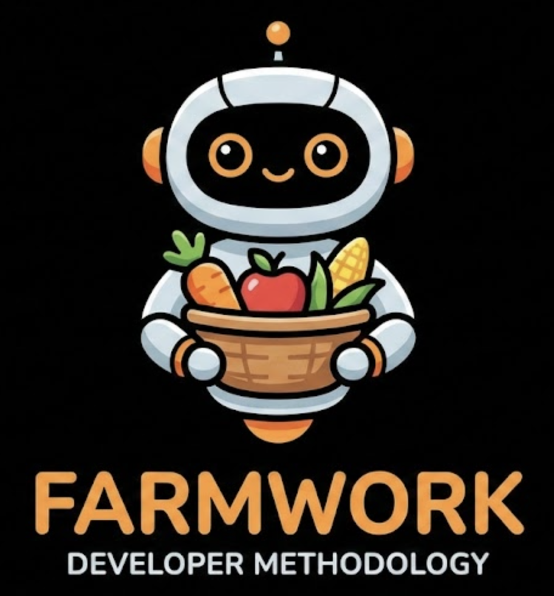

> A workflow framework for Claude Code by Wynter Jones

## Quick Start

```bash
npm install -g farmwork
```

```bash
cd your-project
farmwork init
farmwork doctor
farmwork status
```

Or run directly with npx:

```bash
npx farmwork init
```

----

## The Farmwork Method

### Core Concepts

1. **Skills** - Auto-activating workflows that respond to natural phrases
2. **Slash Commands** - Explicit triggers for actions like `/push`
3. **Agents** - 15 specialized AI subagents for specific tasks
4. **Issue Tracking** - Using beads (`bd`) for full visibility
5. **Living Audits** - Documents that track ongoing concerns
6. **Plan & Implement** - You describe the outcome, the rest is handled
7. **Idea Garden** - Pre-plan creative stage with natural aging

### Skills (Auto-Activating Workflows)

Skills auto-activate when you use these natural phrases:

| Phrase | Skill | What Happens |
|--------|-------|--------------|
| `open the farm` | farm-audit | Audit systems, update FARMHOUSE.md |
| `count the herd` | farm-inspect | Full code inspection (no push) |
| `go to market` | market | i18n + WCAG accessibility audit |
| `go to production` | production | Update BROWNFIELD, strategy check |
| `I have an idea for...` | garden | Plant idea in GARDEN.md |
| `water the garden` | garden | Generate 10 new ideas |
| `compost this...` | garden | Move idea to COMPOST.md |
| `let's research...` | research | Create/update _RESEARCH/ doc |

### Slash Commands (Explicit Actions)

| Command | Description |
|---------|-------------|
| `/push` | Lint, test, build, commit, push (11 steps) |
| `/office` | Interactive strategy setup |

### Skill Activation Hook

Farmwork adds a `UserPromptSubmit` hook that reminds Claude to check for applicable skills. This improves activation reliability over phrase commands in CLAUDE.md.

### Agents

15 specialized agents included:

| Agent | Purpose |
|-------|---------|
| `the-farmer` | Audit and update FARMHOUSE.md metrics |
| `code-reviewer` | Quality & security code review |
| `security-auditor` | OWASP vulnerability scanning |
| `performance-auditor` | Memory leaks, re-renders, anti-patterns |
| `code-smell-auditor` | DRY violations, complexity, naming |
| `accessibility-auditor` | WCAG 2.1 compliance, alt text, contrast |
| `unused-code-cleaner` | Detect and remove dead code |
| `code-cleaner` | Remove comments and console.logs |
| `i18n-locale-translator` | Translate UI text to locales |
| `storybook-maintainer` | Create/update Storybook stories |
| `idea-gardener` | Manage Idea Garden and Compost |
| `researcher` | Systematic research before planning |
| `strategy-agent` | Core loop strategy (what/stopping/why) |
| `onboarding-agent` | Tours, tooltips, modals, empty states |
| `user-guide-agent` | Feature documentation for help docs |

### Recommended Workflow

1. **Start Session**: Run `open the farm` to audit current state
2. **Capture Ideas**: Use `I have an idea for...` to plant ideas in GARDEN
3. **Research**: Use `let's research...` to gather information before planning
4. **Plan Work**: Use `make a plan for...` for new features
5. **Implement**: Use `let's implement...` to execute with tracking
6. **Quality Check**: Run `count the herd` for full audit + dry run
7. **Ship**: Run `close the farm` or `/push` to push changes

You can `go to market` when you have a production-ready app with international users.

## Directory Structure

```
your-project/
├── CLAUDE.md           # Lean instructions (references skills)
├── .claude/            # Claude Code configuration
│   ├── skills/         # Auto-activating workflows (NEW!)
│   │   ├── farm-audit/     # "open the farm"
│   │   ├── farm-inspect/   # "count the herd"
│   │   ├── garden/         # idea management
│   │   ├── research/       # "let's research..."
│   │   ├── production/     # "go to production"
│   │   └── market/         # "go to market"
│   ├── agents/         # 15 specialized subagents
│   │   ├── the-farmer.md
│   │   ├── code-reviewer.md
│   │   ├── security-auditor.md
│   │   └── ... (12 more)
│   └── commands/       # Explicit slash commands
│       ├── push.md
│       └── office.md
├── _AUDIT/             # Living audit documents
│   ├── FARMHOUSE.md    # Framework command center
│   ├── GARDEN.md       # Idea nursery
│   ├── COMPOST.md      # Rejected ideas
│   └── ... (security, performance, etc.)
├── _OFFICE/            # Product strategy
│   ├── GREENFIELD.md   # Vision
│   ├── BROWNFIELD.md   # Reality
│   └── ... (onboarding, user guide)
├── _PLANS/             # Implementation plans
├── _RESEARCH/          # Research documents
├── .beads/             # Issue tracking
└── justfile            # Navigation commands
```

## Commands

### `farmwork init`

Start setting up the new digital farm:

```bash
farmwork init                    # Interactive setup wizard
```

**Options:**
- `-f, --force` - Overwrite existing files

**Storybook Support:**
If you enable Storybook (for React/Vue projects), the wizard will also ask for:
- Storybook URL (e.g., storybook.yoursite.com)
- Netlify Auth Token (for deployment)
- Netlify Site ID
- Password protection preference (recommended)

**Creates:**
- `CLAUDE.md` - Lean instructions (references skills)
- `.claude/` - Claude Code configuration directory
  - `skills/` - 6 auto-activating workflows (farm-audit, farm-inspect, garden, research, production, market)
  - `agents/` - 15 specialized subagents
  - `commands/` - 2 slash commands (/push, /office)
  - `settings.local.json` - Skill activation hook
- `_AUDIT/` - Living audit documents
  - `FARMHOUSE.md`, `GARDEN.md`, `COMPOST.md`, and more
- `_OFFICE/` - Product strategy documents
  - `GREENFIELD.md`, `BROWNFIELD.md`, `ONBOARDING.md`, `USER_GUIDE.md`
- `_PLANS/` - Implementation plans directory
- `_RESEARCH/` - Research documents directory
- `justfile` - Navigation and task commands

### `farmwork status`

Display Farmwork status and metrics.

```bash
farmwork status
```

**Shows:**
- Component counts (agents, commands, audits, plans)
- Office documents status
- Issue tracking status (if beads is configured)
- FARMHOUSE score and open items
- Configuration file status
- Project metrics (tests, stories)

### `farmwork doctor`

Check your Farmwork setup and diagnose issues.

```bash
farmwork doctor
```

**Checks:**
- Core files (CLAUDE.md, .claude/, settings)
- Agents and commands configuration
- Audit system (_AUDIT/, FARMHOUSE.md, _PLANS/)
- Research system (_RESEARCH/)
- Office system (_OFFICE/, CORE_LOOP.md, ONBOARDING.md, USER_GUIDE.md)
- Navigation (justfile, just command)
- Issue tracking (beads)
- Security (.gitignore settings)


## Requirements

- Node.js 18+
- [just](https://github.com/casey/just) (recommended for navigation)
- [beads](https://github.com/steveyegge/beads) (for issue tracking)

## License

MIT

## Links

- [Farmwork Website](https://farmwork.dev)
- [Wynter Jones](https://wynter.ai)
