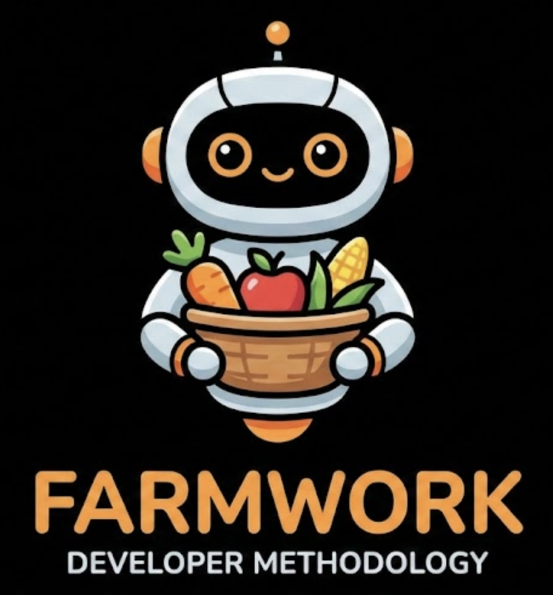

> A workflow framework for Claude Code by Wynter Jones

## Quick Start

```bash
npm install -g farmwork
```

```bash
cd your-project
farmwork init
farmwork doctor
farmwork status
```

Or run directly with npx:

```bash
npx farmwork init
```

`farmwork init` auto-detects your package manager and test/build/lint commands from
`package.json` - there's nothing else to configure.

----

## The Farmwork Method

Farmwork is intentionally small: **2 skills, 4 agents, 1 command**. No issue tracker,
no task runner, no product-strategy scaffolding - just the practices that pull their
weight.

### Core Concepts

1. **Skills** - Auto-activating workflows that respond to natural phrases
2. **Slash Commands** - Explicit trigger for shipping, `/push`
3. **Agents** - 4 focused AI subagents for specific tasks
4. **Living Audits** - `_AUDIT/FARMHOUSE.md` tracks metrics over time
5. **Plan & Implement** - Plans are saved before implementation
6. **Idea Garden** - Pre-plan creative stage with natural aging

### Skills (Auto-Activating Workflows)

Skills auto-activate when you use these natural phrases:

| Phrase | Skill | What Happens |
|--------|-------|--------------|
| `open the farm` | farm-audit | Quick audit: update FARMHOUSE.md metrics |
| `count the herd` | farm-audit | Deep audit: quick audit + full code inspection (no changes/dry-run) |
| `I have an idea for...` | garden | Plant idea in GARDEN.md |
| `water the garden` | garden | Generate 10 new ideas |
| `compost this...` | garden | Move idea to COMPOST.md |
| `let's plan this idea...` | garden | Graduate idea → create a plan in `_PLANS/` |

### Slash Commands (Explicit Actions)

| Command | Description |
|---------|-------------|
| `/push` | Clean, review, test, build, commit, push, update metrics |

### Agents

4 focused agents included:

| Agent | Purpose |
|-------|---------|
| `the-farmer` | Audit and update FARMHOUSE.md metrics |
| `code-reviewer` | Quality, security (OWASP-lite), performance, code smells, and basic accessibility - reports inline |
| `code-cleaner` | Remove comments (except JSDoc), console.logs, and obvious dead code |
| `idea-gardener` | Manage the Idea Garden and Compost |

### Recommended Workflow

1. **Start Session**: Run `open the farm` to audit current state
2. **Capture Ideas**: Use `I have an idea for...` to plant ideas in GARDEN
3. **Plan Work**: Say "make a plan for..." and save it to `_PLANS/`
4. **Implement**: Build the feature
5. **Quality Check**: Run `count the herd` for a full inspection before shipping
6. **Ship**: Run `/push` to review, gate, commit, and push

## Directory Structure

```
your-project/
├── CLAUDE.md              # Lean instructions (references skills)
├── AGENTS.md              # Same workflow, plain instructions for Codex/Gemini CLI/etc.
├── _AUDIT/                 # Living audit + idea documents
│   ├── FARMHOUSE.md         # Framework command center / metrics
│   ├── GARDEN.md            # Idea nursery
│   └── COMPOST.md           # Rejected ideas archive
├── _PLANS/                 # Implementation plans
└── .claude/                # Claude Code configuration
    ├── skills/
    │   ├── farm-audit/      # "open the farm" / "count the herd"
    │   └── garden/          # idea management
    ├── agents/
    │   ├── the-farmer.md
    │   ├── code-reviewer.md
    │   ├── code-cleaner.md
    │   └── idea-gardener.md
    └── commands/
        └── push.md
```

## Commands

### `farmwork init`

Set up your farm. Close to non-interactive - Farmwork detects your package manager
(from lockfiles) and test/build/lint commands (from `package.json` scripts) on its own.

```bash
farmwork init                    # Auto-detects everything, confirms and goes
```

**Options:**
- `-f, --force` - Overwrite existing files without prompting

**Creates:**
- `CLAUDE.md` - Lean instructions (references skills)
- `AGENTS.md` - Same core workflow as plain instructions, for Codex, Gemini CLI, and
  other AI coding assistants that don't support Claude Code's skills/subagents
- `.claude/` - Claude Code configuration directory
  - `skills/` - 2 auto-activating workflows (farm-audit, garden)
  - `agents/` - 4 focused subagents
  - `commands/` - 1 slash command (`/push`)
- `_AUDIT/` - Living audit documents: `FARMHOUSE.md`, `GARDEN.md`, `COMPOST.md`
- `_PLANS/` - Implementation plans directory

### `farmwork status`

Display Farmwork status and metrics.

```bash
farmwork status
```

**Shows:**
- Component counts (agents, commands, skills, audits, plans)
- FARMHOUSE score
- Configuration file status
- Test file count

### `farmwork doctor`

Check your Farmwork setup and diagnose issues.

```bash
farmwork doctor
```

**Checks:**
- Core files (CLAUDE.md, `.claude/`)
- Agents, commands, and skills configuration
- Audit system (`_AUDIT/FARMHOUSE.md`, `_AUDIT/GARDEN.md`, `_AUDIT/COMPOST.md`, `_PLANS/`)
- Security (`.gitignore` settings)

## Cross-Tool Support

Farmwork's phrase workflows are built around Claude Code's skills, but the CLI also
generates `AGENTS.md` - a plain-instructions version of the same workflow (folder
structure, phrase-triggered audits/garden, plan-first development) for Codex, Gemini
CLI, and other AI coding assistants that can't auto-invoke `.claude/skills/`.

## Requirements

- [Claude Code](https://claude.com/claude-code), or another AI coding assistant that
  reads `AGENTS.md` (Codex, Gemini CLI, etc.)
- Node.js 18+

No other tools required - Farmwork has no external CLI dependencies.

## License

MIT

## Links

- [Farmwork Website](https://farmwork.dev)
- [Wynter Jones](https://wynter.ai)
